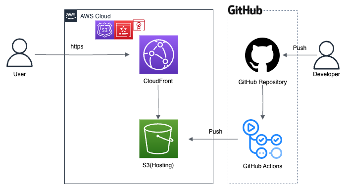

# HomePage

## 概要
阿部寛Likeなホームページです

https://izmyuta.com/

## 工夫したポイント
- 本家のページと同様、軽さを重視した
  - HTMLとCSSだけのシンプルなページ
  - CloudFrontを使ってCDNを構築することでさらに高速化
- ipv6通信にも対応
  - 最近何かと話題なので
  - DNSにレコード追加するだけだったのでそこまで難しくなかった

## 大変だったポイント
- S3：パブリックアクセスのセキュリティをガチガチに固めるとGitHub Actionsでデプロイできなくなった
  - CloudFrontからのアクセスに限定したいので、パブリックアクセスは拒否したいが、ワークフローも維持しておきたい...
- CloudFront：S3バケットが更新されても、CloudFrontにすぐ反映されない
  - 約1日したら反映されるようになった。CDNの仕組みをよく理解していなかったので最初は驚いた。
  - キャッシュのTTLが長めなのが原因。現状の運用で問題ないので、TTLを短くするなどの対処はしない(コスト増につながるため)。
- スマホ版でも見れるようにするのが大変だった
  - -webkit-text-size-adjustの値やViewPortを色々いじることで対応

## サービス構成図

